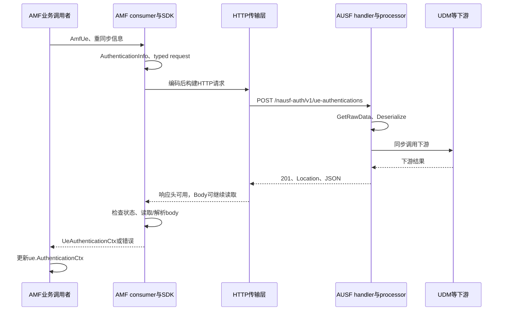

# Free5gc-TYcustom NF 间 HTTP 代码阅读教程

这份教程的目标是：你能够拿着一条具体请求，从业务数据的来源，追到 JSON/二进制编码、HTTP 发送、对端处理、响应读取、状态更新，并说明每一段由谁执行、在哪里等待、占着什么资源，以及怎样用实验验证瓶颈。

建议采用 **“先走通一条调用链，再给这条链加上数据、并发、资源、测量四层说明”** 的阅读方法。不要一开始就通读全部 NF，也不要一开始就钻进 HTTP/2 底层。

本文基于 `D:\UB\Nemo\5GC_project\code\Free5gc-TYcustom` 的静态代码，核对时间为 2026-09-06，仓库 HEAD 为 `d357b888db35ff78ba8dc2220130150b23747e9d`。下文相对路径均从这个目录开始。IDE 中另一个 `Free5gc_TYcustom_v3.4.3` 目录不属于本文分析对象。

这里没有启动 NF 或进行压测。本机当前也没有可调用的 Go 工具链；外部模块的最终解析目录、生成客户端的完整实现，以及运行时请求是否成功，需要按下面的步骤在实际构建/运行环境核对。文中分别使用“代码事实”“推断”“待验证”区分证据强度。

## 1. 先明确：你最终要回答的不是一个问题，而是六个问题

你提出的四个方向很关键。为了让阅读形成闭环，建议整理成以下六条主线，每次阅读同一条请求时重复使用。

| 主线 | 要回答的问题 | 阅读产物 |
|---|---|---|
| 业务与边界 | 为什么发这个请求？什么算成功？HTTP 完成与注册/会话完成有何关系？ | 一张业务调用图、明确的完成条件 |
| 数据与协议 | 字段来自哪里？经过哪些类型？哪些字段实际发送？URL、header、body 如何形成？ | 字段溯源表、请求/响应契约卡 |
| 控制流与并发 | 谁调用谁？谁同步等待？在哪里启动 goroutine？哪些顺序有代码保证？ | 带 goroutine、锁和队列的时序图 |
| 状态与资源 | UE 状态谁持有？连接、stream、worker、DB 连接由谁复用和释放？ | 资源与生命周期表 |
| 失败与恢复 | 超时覆盖哪一段？取消能否传到下游？重试是否重复写状态？失败后清理什么？ | 失败分支表 |
| 测量与容量 | 每个时间戳在哪里取？负载如何放大？哪个假设可以被实验推翻？ | 延迟分解表、瓶颈假设与实验记录 |

尤其要补上后三类容易遗漏的内容：**生命周期、异常路径、测量口径**。只看正常路径和函数调用关系，无法判断高并发时为什么堆积、为什么超时后仍消耗资源、为什么日志看起来很快但业务很慢。

## 2. 推荐的阅读顺序与每一阶段的完成标准

每阶段可以拆成若干次 45–90 分钟的阅读。阶段结束时先交出一份小产物，再继续下一阶段。

| 阶段 | 这次只解决什么 | 必须留下的结果 | 可以进入下一阶段的标准 |
|---|---|---|---|
| 0 | 确定代码、模块、配置、二进制对应关系 | 环境卡 | 能解释 import 实际跳到哪里 |
| 1 | 走通 AMF→AUSF 的一条 JSON 请求 | 不超过 15 个节点的调用链 | 能从调用入口走到结果被 AMF 使用 |
| 2 | 逐层跟踪数据与完整 response | 字段表、HTTP 契约卡 | 能区分 struct、JSON bytes、HTTP request、响应模型 |
| 3 | 展开 AUSF→UDM→UDR→MongoDB | 嵌套调用图 | 能指出等待下游的父请求与条件分支 |
| 4 | 给前三阶段补并发和资源 | goroutine 图、锁/队列表 | 能区分确定顺序与某次运行的顺序 |
| 5 | 读本地 HTTP/2 与观测代码 | 时间戳定义表 | 能解释每段延迟包含和遗漏什么 |
| 6 | 读 AMF→SMF 与 SMF→BSF | NF 差异表 | 理解 multipart、回调和不同 transport |
| 7 | 做可复核的容量实验 | 一份瓶颈证据报告 | 能用数据支持并限制自己的结论 |

第一次只做阶段 0、1。你不需要先把整个 5GC 学完；遇到 `SUPI`、`DNN`、`S-NSSAI` 等概念时，先弄清当前函数如何使用它，再按需要补协议背景。

## 3. 阶段 0：先确定读到的代码就是构建使用的代码

### 3.1 建立最小目录地图

| 位置 | 在阅读中承担什么角色 |
|---|---|
| [NFs/amf/internal/gmm/handler.go](NFs/amf/internal/gmm/handler.go) | AMF 业务过程，以及一些 SBI 请求的触发点 |
| `NFs/<nf>/internal/sbi/consumer/` | 当前 NF 调用其他 NF 的业务适配层 |
| `NFs/<nf>/internal/sbi/api_*.go`、`router.go`、`server.go` | 服务启动、路由、HTTP 入站解析 |
| `NFs/<nf>/internal/sbi/processor/` | 对端业务处理；可能继续调用下游 |
| `NFs/<nf>/internal/context/` | NF、UE、会话等长期状态 |
| `NFs/<nf>/internal/accesslog/` | 部分 NF 的自定义 HTTP transport、日志与观测 |
| [xnet/http2](xnet/http2) | 本仓库定制的 HTTP/2 实现 |
| [config](config)、[Makefile](Makefile) | 配置来源与各 NF 的构建入口 |
| 外部 Go module 中的 `github.com/free5gc/openapi` | 模型、生成客户端、公共编解码与 HTTP 调用逻辑 |
| 外部 Go module 中的 `github.com/free5gc/util` | Gin/server、OAuth、MongoDB 等公共工具，具体使用由各 NF 决定 |

`consumer` 表示调用方角色，一个 NF 既可以作为 consumer，也可以接收另一个 NF 的调用。不要据此把一个 NF 固定理解为“客户端”或“服务端”。

### 3.2 本仓库已经确认的差异

- 各 NF 是独立 Go module，并非只由顶层一个 `go.mod` 管理。
- [AMF go.mod](NFs/amf/go.mod) 声明 `go 1.25.5`、`openapi v1.2.3`，并有 `replace golang.org/x/net => ../../xnet`。
- AMF、AUSF、NRF、NSSF、PCF、UDM、UDR 这七个 NF 有上述本地 `xnet` 替换；[SMF go.mod](NFs/smf/go.mod) 没有这个替换。
- 各 NF 的 `util` 版本并不完全相同。例如 UDR 声明 `v1.3.1`，AMF 使用另一个伪版本。因此不能用某个 NF 的公共依赖实现替代全部 NF。
- 当前目标目录没有内置 `NFs/openapi`。不要为了方便直接跳去旁边旧版本目录的生成代码。
- 当前 [amfcfg.yaml](config/amfcfg.yaml) 第 146 行附近配置 `ngapWorkerPoolSize: 2000`、`ngapTaskBufferSize: 256`；其默认值注释与当前 scheduler 实现不同，应读实际函数。
- 当前配置文件的 `scheme: http` 只是 URI scheme。使用哪个 transport 决定它实际走 HTTP/1.1 还是明文 HTTP/2。

在 Windows 阅读工作区，可先执行这些只读搜索：

```powershell
Set-Location 'D:\UB\Nemo\5GC_project\code\Free5gc-TYcustom'
rg -n 'replace|free5gc/(openapi|util)|golang.org/x/net|^go ' NFs -g go.mod
rg -n 'scheme:|oauth:|ngapWorkerPoolSize:|ngapTaskBufferSize:' config -g '*.yaml'
rg -n 'SetHTTPClient|http.Client\{|http2.Transport\{|ListenAndServe|NewServer' NFs -g '*.go'
```

在有 Go 的实际构建环境中，进入具体 NF 的 module 目录核对。例如 AMF：

```powershell
Set-Location 'D:\UB\Nemo\5GC_project\code\Free5gc-TYcustom\NFs\amf'
go version
go env GOMOD GOWORK GOMODCACHE GOROOT GOFLAGS
go list -m -json github.com/free5gc/openapi github.com/free5gc/util golang.org/x/net
go list -f '{{.Dir}}' github.com/free5gc/openapi/ausf/UEAuthentication
go list -f '{{.Dir}}' github.com/free5gc/openapi/models
go list -f '{{.Dir}}' golang.org/x/net/http2
```

依赖不在缓存时，`go list` 可能需要下载；这一步是定位实际依赖，不是要求修改版本。对 SMF、UDR 分别再核对一次。运行主机上的 `go version -m <实际NF二进制路径>` 可帮助检查二进制构建信息，但仍需记录镜像、挂载配置和源码差异。

环境卡至少记：commit/未提交改动、NF 二进制或镜像、Go 版本、module 解析结果、启动参数、实际加载的 YAML、CPU 配额/亲和性、内存限制、NF 副本数、SCTP association 数、日志与 profiling 开关。**配置文件存在，不代表进程加载了它。**

## 4. 阶段 1：第一条主线选 AMF→AUSF 鉴权请求

选它作为起点，是因为 AMF 侧数据构造很短，AUSF 有明确的入站反序列化与 JSON 响应，并且之后可以自然展开 UDM/UDR。

### 4.1 第一遍只读下面这些位置

行号是本次快照的导航参考；代码变化后请优先按函数名定位。

| 顺序 | 文件与锚点 | 这一步回答什么 |
|---|---|---|
| 1 | [AMF gmm/handler.go](NFs/amf/internal/gmm/handler.go)，`AuthenticationProcedure`，约 1661 行 | 业务为什么进入鉴权？何时需要 AUSF？ |
| 2 | 同函数，约 1682–1708 行 | NRF 查询、AUSF 选择、`ue.AusfUri` 赋值、发起调用之间的关系 |
| 3 | [AMF consumer/ausf_service.go](NFs/amf/internal/sbi/consumer/ausf_service.go)，`SendUEAuthenticationAuthenticateRequest`，53 行 | 怎样从 `*AmfUe` 构造请求模型 |
| 4 | 同文件，`getUEAuthenticationClient`，29 行 | SDK client 怎样按 URI 缓存；如何注入 `accesslog.Client()` |
| 5 | 外部 `openapi/ausf/UEAuthentication`，`UeAuthenticationsPost` | endpoint、method、header、body 由什么代码确定 |
| 6 | 外部 `openapi` 公共 helper | Go 值如何编码为 body；怎样交给 `http.Client` |
| 7 | [AUSF api_ueauthentication.go](NFs/ausf/internal/sbi/api_ueauthentication.go)，`HTTPUeAuthenticationsPost`，约 145 行 | 对端如何读 body、反序列化并调用 processor |
| 8 | [AUSF processor/ue_authentication.go](NFs/ausf/internal/sbi/processor/ue_authentication.go)，`UeAuthPostRequestProcedure`，约 230 行 | 业务处理；首遍把下游调用折叠成一个方框 |
| 9 | 同文件约 482–483 行，`Location` 与 `c.JSON(http.StatusCreated, ...)` | 响应状态、header、body 分别在哪里产生 |
| 10 | 回到生成客户端与 AMF consumer | 响应 body 的读取、解析、错误转换与 typed result |
| 11 | 回到 AMF `AuthenticationProcedure`，约 1729 行 | `ue.AuthenticationCtx` 如何被赋值，后面如何继续 |

在第 5、6、10 步，如果 IDE 无法跳转，使用阶段 0 的 `go list` 定位外部模块。调用入口已在本地确认，但本次没有取得完整的该服务生成源码，不能给它编造本地文件名和行号。

接收端再反向核对一次路由装配：[AUSF server.go](NFs/ausf/internal/sbi/server.go) 怎样建立 router、挂入站 metrics/accesslog、创建服务 group 并接入 authorization middleware；`getUeAuthenticationRoutes` 怎样将 POST `/ue-authentications` 绑定到上述 handler。确认完整 prefix、method、path 都匹配，才算把网络两端连上。

### 4.2 第一遍的简化图



这是一张逻辑图，不意味着整个传输层与业务层都在同一 goroutine 中执行，也不证明当前部署已经成功走通。

**本阶段自测：** 关闭文档后，你能否从 `AuthenticationProcedure` 出发，在 IDE 里依次找到模型构造、HTTP 调用、AUSF 路由、响应生成和 AMF 状态更新？能做到才算走完第一圈。

## 5. 阶段 2：沿同一条链追踪数据，不要只背函数名

### 5.1 数据不是从 JSON 字符串开始的

这条请求的起点是已经存在的 AMF UE 状态。通常先构造 Go struct，再由公共 helper 序列化。要区分：

```text
NF配置 + *AmfUe + 本次函数参数
  → models.AuthenticationInfo
  → UeAuthenticationsPostRequest（SDK参数容器）
  → JSON字节 / bytes.Buffer
  → *http.Request（URL、Method、Header、Body、Context）
  → HTTP/2 HEADERS与DATA帧
  → TCP字节流
  → 对端 *http.Request 与 Body
  → AuthenticationInfo
  → 业务结果模型
  → JSON响应字节
  → 客户端 *http.Response
  → SDK响应模型
  → AMF长期UE状态
```

这里的 SDK 参数容器不一定原样成为 JSON 外层对象。必须看生成操作选择哪个字段作为 `postBody`，以及模型的 `json` tag、`omitempty`、自定义 `MarshalJSON`。HTTP/2 帧边界、TCP 分段边界与 JSON 对象边界也不是一回事。

### 5.2 为关键字段做一张溯源表

本地 `ausf_service.go` 已确认以下赋值：

| 数据 | 当前来源 | 含义/下一步要追什么 |
|---|---|---|
| `authInfo.SupiOrSuci` | `ue.Suci` | 标识本次鉴权对象；继续向上追 `Suci` 如何从 NAS 身份写入 UE |
| `ServingNetworkName` | `ServedGuamiList[0].PlmnId`，MNC 转整数后补足三位 | 形成服务网络名称；核对使用的是哪份 GUAMI 配置 |
| `ResynchronizationInfo` | 函数的可选参数 | 仅非 nil 时设置，触发另一条业务分支 |
| SDK BasePath | `ue.AusfUri` | 上游 NF 发现/选择的结果，不是 UE 身份字段 |
| `ctx` | `GetTokenCtx(NAUSF_AUTH, AUSF)` | 请求取消/认证相关上下文；与 `AmfUe` 分开分析 |
| `ue.AuthenticationCtx` | consumer 返回的 `UeAuthenticationCtx` | 后续 AKA confirmation 使用的长期状态与链接 |

用下面的示意 JSON 检查你对字段的理解，**它不是本次抓到的报文，也不是完整字段集合**：

```json
{
  "supiOrSuci": "suci-0-208-93-0-0-0-0000000001",
  "servingNetworkName": "5G:mnc093.mcc208.3gppnetwork.org"
}
```

接下来到实际模块中的模型定义核对 tag、可选字段和编码规则，再用一条低负载真实请求核对实际报文。不要把 `AuthenticationInfo` 字段名直接当作线上字段名，也不要把整个 `AmfUe` 当作发送对象。

### 5.3 公共编码层怎样读

本次查阅了声明版本的官方 [openapi v1.2.3 client.go](https://raw.githubusercontent.com/free5gc/openapi/v1.2.3/client.go)。可用 `PrepareRequest`、`setBody`、`Serialize`、`MultipartEncode`、`CallAPI`、`Deserialize` 作为搜索锚点：它们分别连接参数、编码、HTTP 调用和解码。`CallAPI` 会优先使用 configuration 注入的 HTTP client。最终仍应以实际 module 解析出的源码为准。

这一层只做一遍详细阅读，之后其他 NF 调用相同 helper 时复用笔记。生成操作里仍需逐项检查：

1. BasePath 与 endpoint 怎样拼接，path/query 参数怎样编码。
2. `Content-Type` 与 `Accept` 怎样选择；认证 header 在哪里添加。
3. 请求 body 是哪个对象，是否有额外包裹层、multipart 或表单分支。
4. 编码失败是否发生在 HTTP 发送之前。
5. `http.Client.Do` 返回后，哪里读 body、检查状态、解析模型、关闭 body。
6. 成功、非 2xx、无 body、坏 JSON、网络错误是否分别处理；哪个分支遗漏清理。

不要凭某个生成器的习惯断言“这里肯定 defer Close”。实际操作源码没读到，就把 body 所有权/关闭位置记为待核对。

### 5.4 给每条接口填写 HTTP 契约卡

```text
接口 / 业务触发条件：
调用方函数 → 接收方路由 → processor：
method + 完整path模板 + query：
目标地址来源 / 服务发现命中情况：
Content-Type / Accept / Authorization：
请求模型 / 实际序列化对象 / 二进制部分：
成功status / response header / body模型：
错误status / ProblemDetails / Go error：
body读取者 / body关闭者：
调用完成后更新哪些状态：
HTTP成功是否意味着业务流程完成：
证据位置 / 尚未确认的点：
```

这张卡也适用于 GET。GET 可能只有 path/query，不能预设“每个 HTTP req 都先生成 JSON body”。

## 6. 阶段 3：把 AUSF 内部的下游方框展开

### 6.1 按调用关系展开，不按 NF 目录逐个通读

预期的正常 5G-AKA 分支可以画成下面的嵌套等待关系。具体能否命中路由，需完成下一小节的契约核对。

```text
AMF 等待 AUSF 鉴权请求
  AUSF 等待 UDM GenerateAuthData
    UDM 等待 UDR QueryAuthSubsData
      UDR 等待 Mongo wrapper GetOne
    UDM 根据返回数据检查/更新SQN等
    UDM 等待 UDR 修改鉴权订阅数据
      UDR 等待数据库读取/修改
      UDR 可以启动数据变更通知goroutine
    UDM 执行鉴权向量计算并返回
  AUSF 建立/更新鉴权上下文并返回
AMF 使用鉴权结果继续NAS过程
```

| 子链 | 建议文件与函数锚点 | 重点 |
|---|---|---|
| AUSF→UDM | [AUSF consumer/udm_service.go](NFs/ausf/internal/sbi/consumer/udm_service.go)，`GenerateAuthDataApi` | 将传入的 `AuthenticationInfoRequest` 转成 `UdmUeauAuthenticationInfoRequest`，包装为 `GenerateAuthDataRequest`，获取 token context 后同步调用 |
| UDM 接收与业务 | [UDM processor/generate_auth_data.go](NFs/udm/internal/sbi/processor/generate_auth_data.go)，`GenerateAuthDataProcedure` | 约 151 行查询 UDR；约 394–417 行修改 SQN；之后鉴权计算与响应 |
| UDM 目标定位 | [UDM consumer/udr_service.go](NFs/udm/internal/sbi/consumer/udr_service.go)，`getUdrURI` | 查找/创建 UDM UE、复用 `UdrUri`、必要时发现 UDR |
| UDR 业务入口 | [UDR processor/authentication_data_document.go](NFs/udr/internal/sbi/processor/authentication_data_document.go)，`QueryAuthSubsDataProcedure`、`ModifyAuthenticationProcedure` | GET 返回数据；PATCH 更新并触发通知准备 |
| UDR→DB | [mongo_db_inplement.go](NFs/udr/internal/database/mongodb/mongo_db_inplement.go)，`GetDataFromDB`、`PatchDataToDBAndNotify` | PATCH 路径可包含 GetOne、JSONPatch、GetOne 三次 wrapper 调用 |
| DB 包装层 | [UDR dbtrace.go](NFs/udr/internal/dbtrace/dbtrace.go)，`RestfulAPIGetOne` 等 | 计时范围是公共 Mongo helper 调用，不是纯 Mongo 服务端执行时间 |
| 异步通知 | [UDR processor/callback.go](NFs/udr/internal/sbi/processor/callback.go)，`PreHandleOnDataChangeNotify`、`SendOnDataChangeNotify` | 明确的 `go` 分叉；有匹配订阅时才发出通知 HTTP |

三次 DB wrapper 调用不等于恰好三条 Mongo wire command；公共 helper、driver、重试可能继续展开。需要到底层 driver 时再进入 **UDR 实际使用的** `util/mongoapi` 与 MongoDB driver。

### 6.2 一个真实的“先核对契约再讨论性能”练习

本地 [UDR api_datarepository.go](NFs/udr/internal/sbi/api_datarepository.go) 约 105、112 行将鉴权订阅 PATCH/GET 路由写为：

```text
/subscription-data/:ueId/:servingPlmnId/authentication-subscription
```

而 UDM 的 `QueryAuthSubsDataRequest` 构造只显式设置 `UeId`，修改请求设置 `UeId` 和 patch。**仅凭这些本地代码不能断言生成客户端构造的 path 与这里一致。**

请把这作为第一项契约验证：在实际 `openapi v1.2.3` 生成操作里找到 URL 模板，与 UDR 路由逐段比较，再观察一次实际 status/path。如果不匹配，先确认实际部署代码、依赖或路由差异。不能把快速返回的 404 纳入“成功鉴权延迟”，也不能把本文的预期主线当成已经实测成功的证明。

### 6.3 学会区分三种“context”

| 类型 | 保存什么 | 常见生命周期 | 阅读时的问题 |
|---|---|---|---|
| `AmfUe`、`UdmUeContext`、`SMContext`、NF Context | 业务身份、会话、状态、目标 URI、缓存等 | 可跨越多次 HTTP 请求 | 哪个 pool 持有指针？谁修改、加锁、删除？ |
| `context.Context` | deadline、cancel、认证/trace 等值 | 通常跟随一次调用或派生调用 | 从谁派生？是否继承入站取消？谁调用 cancel？ |
| `*gin.Context` | 当前入站请求、ResponseWriter、路由参数、中间件数据 | 当前 handler | 是否在 handler 返回后被 goroutine 使用？哪些字段需提前复制？ |

代码事实：[AMF context.go](NFs/amf/internal/context/context.go) 的 `GetTokenCtx` 约 562 行，在 OAuth 未启用分支返回 `context.TODO()`。AUSF、UDM 也有类似分支。上述下游调用点从 NF 的 `GetTokenCtx` 获取 ctx，不能据函数名就认为它继承了 `c.Request.Context()`。

推断：上游取消后，下游调用不一定立刻停止，可能继续消耗 worker、连接和 DB 资源。是否发生，要结合实际 OAuth 分支、HTTP timeout 与取消传播实验确认。当前 [nrfcfg.yaml](config/nrfcfg.yaml) 中 `oauth: true`，所以也不能简单假设部署中没有 OAuth/token 路径。

同样，`sync.Map` 只解决 map 容器访问的同步，不自动保护存进去的 `*UE` 的所有可变字段。每看到一个 pool，都继续追对象内部字段的读写者。

### 6.4 沿原链返回，再走一遍失败分支

| 失败发生的位置 | 这时已经做了什么 | 必须回答的问题 |
|---|---|---|
| 目标选择、token、序列化失败 | 可能尚未发送目标业务 HTTP，但可能已访问 NRF | 谁返回错误？之前分配的 UE/session 状态是否要撤销？ |
| 对端返回非 2xx / ProblemDetails | 传输可能完全正常，业务拒绝请求 | SDK 如何映射 status/body？consumer 与上层是否真的检查了它？ |
| 连接失败、取消、超时 | 请求可能未到对端，也可能对端已执行但响应未收到 | 如何区分“未执行”与“结果未知”？能否安全重试？ |
| headers 已到、body 读取或 JSON 解码失败 | transport 日志可能已结束，对端甚至已经提交修改 | 谁关闭 body、返回什么错误，是否错误地当作成功？ |
| HTTP 成功后 callback / PFCP 失败 | 创建 HTTP 可能已成功，但后续业务没有完成 | 哪个状态表示部分完成？谁补偿、删除、重试或通知失败？ |

不要把 transport retry、consumer 重试、NAS 定时器重传和一次新的业务调用混成一种 retry。分别记录触发者、次数、间隔、deadline、可重放 body 与幂等依据。尤其对创建资源和 UDM 的“先读 SQN 再 PATCH”，继续核对重复/同 SUPI 并发请求的一致性保障；静态调用顺序本身并不证明原子性。

`defer`、`Unlock`、`Body.Close`、`cancel`、会话池删除与 IP/ID 归还，都要沿每个 return 分支检查。超时预算也分层记录：上层过程定时器、HTTP client 总 timeout、拨号/健康检查、DB 操作 timeout，不能只记一个“10 秒”。

## 7. 阶段 4：在调用图上标出并发边界与资源占用

### 7.1 区分“同步调用”“并发”“并行”

- 普通函数调用：当前 goroutine 必须等函数返回，才能执行后一句。
- 同步 HTTP：调用者 goroutine 等待结果；Go runtime 可以调度其他 goroutine，但这个 worker 尚未处理完当前任务。
- `go f()`：创建并发执行分支。创建动作与新 goroutine 开始之间有顺序关系，父 goroutine 后续语句与子 goroutine 的具体执行先后通常没有保证。
- 并发不等于同时占用不同 CPU。CPU 配额、`GOMAXPROCS`、可运行 goroutine 数、I/O 等待共同影响实际并行度。
- mutex/channel/条件变量可以建立局部顺序关系；不能据此宣称整个 NF 全局有序。Go 的相关保证见官方 [Memory Model](https://go.dev/ref/mem)。

日志只能说明某次运行观察到了什么，不能证明所有执行都遵守同样顺序。先用代码建立必然顺序，再用 trace/log 测量其余部分。

### 7.2 AMF 请求生成前的队列必须一起读

相关文件：[NGAP service.go](NFs/amf/internal/ngap/service/service.go)、[scheduler.go](NFs/amf/internal/ngap/scheduler.go)、[NAS handler.go](NFs/amf/internal/nas/handler.go)。

```text
SCTPRead
 → dispatchToWorkerPool
 → UEScheduler.DispatchTask
 → Worker.Submit / taskChan
 → Worker.run
 → ngap.Dispatch
 → NGAP处理 / HandleNAS / NAS Dispatch / GMM
 → consumer / 同步HTTP调用
 → 当前消息处理返回
 → 该worker才取下一项
```

当前实现要特别注意：

1. `Worker.run` 约 61–79 行直接调用 `w.handler(...)`，不会为每个 task 再开一个 goroutine。
2. `Worker.Submit` 约 106 行在 `taskChan` 满时等待，形成向上游读取路径传播的背压。
3. 单 association 模式按提取的 UE ID 取模；不同 UE 也可能落到同一 worker。要进一步核对实际提取的是哪种 NGAP ID，不能用一个笼统的“UE ID”覆盖身份切换。
4. 观察到至少两个活跃 SCTP association 后，调度器会锁定到 dGNB 模式，按 association 固定到 worker。一个 association 上的多 UE 因而共享一条串行处理队列。
5. `ResolveWorkerPoolSize` 的自动值是 `runtime.NumCPU()*60`，上限 10000；当前 YAML 显式设置 2000，初始化还要看 [AMF init.go](NFs/amf/pkg/service/init.go)。

因此，2000 个 worker 不意味着有 2000 条有效并发业务链。dGNB 只有少量 association 时，增加池大小可能帮助很小。这个瓶颈可能发生在 JSON 构造之前，所以只量 HTTP 无法解释完整注册延迟。

### 7.3 对每一种等待记录“等的时候还占着什么”

| 资源/边界 | 作用域与调度者 | 等待时需要继续追的问题 |
|---|---|---|
| NGAP worker 队列 | AMF scheduler，固定 worker/channel | 同队列哪些 UE 被前一个下游 HTTP 拖住？满了会堵哪个 SCTP reader？ |
| `ue.Lock` / `SMLock` | 某个 UE/会话及其读写路径 | 锁是否跨网络等待？回调是否要拿同一把锁？ |
| SDK client map 的 RWMutex | 某个 NF consumer 服务对象 | 冷启动创建是否重复？锁保护的是 map 还是整个 HTTP 调用？ |
| HTTP client / transport pool | NF 进程内共享对象 | 按什么 key 复用？空闲关闭、拨号、重试何时发生？ |
| HTTP/2 stream 配额与写锁 | 单条 HTTP/2 连接 | 多少请求共享它？等配额时是否还占着其他锁？ |
| 服务端 handler 调度 | HTTP/2 serverConn | 请求是否等 admission，再等 goroutine 获得 CPU？ |
| MongoDB 连接池 | driver/client 实例 | 是等选 server、等连接 checkout，还是等 command 返回？ |
| 日志队列与 writer | NF 的 accesslog | 队列满丢日志还是阻塞？buffer 保留多少内存？ |
| CPU、内存、socket | Go runtime、OS、容器 | runnable 排队、GC、socket buffer、CPU throttling 是否增长？ |

对指针、slice、map 再加一项：是否仍引用读循环复用的 buffer？异步入队前在哪复制？谁持有最后一个引用？不要仅凭函数参数按值传递就断言数据被深拷贝。

### 7.4 用三种标记画时序

```text
[S] 同一goroutine顺序执行
[HB] 锁/channel等建立的先后约束
[?] 静态代码不足以确定两事件的相对顺序
```

例如 UDR `go SendOnDataChangeNotify(...)` 与父 handler 返回 204 后的传输完成，可标 `[?]`。内部每条通知是否逐个发送，则继续看子 goroutine 的循环，不能因为外面有一个 `go` 就认为所有通知互相并行。

**本阶段自测：** 能否指出一个“CPU 空闲但业务仍排队”的具体场景？例如同一个 worker 同步等 UDM，而同队列的新任务不能执行。

## 8. 阶段 5：再进入本地 HTTP/2，沿一条 stream 阅读

### 8.1 先读装配，再读 transport 内部

起点：[AMF accesslog/httptransport.go](NFs/amf/internal/accesslog/httptransport.go)，依次看 `Client`、`newLoggingRoundTripper`、`nextSlot`、`loggingRoundTripper.RoundTrip`。再到 [AUSF server.go](NFs/ausf/internal/sbi/server.go) 或 [AMF server.go](NFs/amf/internal/sbi/server.go)，看 `newHttp2ServerWithIdleTimeout`。

当前七个带 instrumentation 的 NF 使用本地 `http2.Transport`；明文分支通过 `AllowHTTP` 与普通 TCP dial 实现 h2c。当前 `connsPerPeer = 2`，为每个 peer、每种 scheme 维护轮转计数，分配到两个独立 transport 槽位。

这里有三层不同对象：

```text
按URI缓存的SDK APIClient
  → 共享的 *http.Client
    → loggingRoundTripper中的transport槽位
      → 每个transport内部的连接池
        → TCP连接 / HTTP2 ClientConn
          → 多个stream
```

**两个槽位不是启动即建好两条 TCP，也不是连接数硬上限。** 请求触发懒拨号，transport 还可能更换或扩展连接。`conn_slot` 只能表示选了哪个槽位；要同时看实际 `conn` 与连接生命周期。按请求数量均分也不等于按请求成本或在途数均衡。

当前自定义 client 的 timeout 为 10 秒，read-idle 为 1 秒，ping timeout 为 3 秒；server 的 HTTP/2 idle timeout 为 500ms。它们分别作用于不同对象，idle timeout 不能解释成“每个业务请求只许执行 500ms”。HTTPS 分支、SMF/BSF 分支要重新检查装配，不能直接套用这里的 h2c 与 tracing 结论。

### 8.2 底层只沿这些锚点前进

| 位置 | 先搜索的函数/对象 | 要看懂的事 |
|---|---|---|
| [xnet/http2/transport.go](xnet/http2/transport.go) | `RoundTripOpt`、`ClientConn.roundTrip`、`clientStream.writeRequest` | 连接获取、retry、写请求与等响应的 goroutine 边界 |
| [xnet/http2/client_conn_pool.go](xnet/http2/client_conn_pool.go) | `GetClientConn`、`getClientConn` | 按 peer 选连接、懒拨号、stream 预留及扩池条件 |
| 同文件 | `reqHeaderMu`、`awaitOpenSlotForStreamLocked`、`addStreamLocked` | 请求头发送准入、stream 配额、stream ID 分配 |
| 同文件 | `encodeAndWriteHeaders`、`writeRequestBody`、`wmu` | header 编码与共享写路径、body flow control |
| 同文件 | `clientConnReadLoop`、`processHeaders`、`transportResponseBody.Read` | 同连接的响应如何分发给各 stream；header 返回与 body 读取分离 |
| [xnet/http2/server.go](xnet/http2/server.go) | `scheduleHandler`、`handlerDone`、`runHandler` | handler 并发、等待队列和创建 goroutine 的位置 |
| 同文件 | `serve`、`readFrames`、`processHeaders`、`scheduleFrameWrite` | 每连接的共享读帧、状态处理与写调度；并非每个 stream 都有独立 TCP 读写通道 |
| [xnet/http2/write.go](xnet/http2/write.go)、[http2.go](xnet/http2/http2.go) | `writeResHeaders`、`writeWithByteTimeout` | response buffer、实际 conn.Write、W 事件 |
| [instrument_client.go](xnet/http2/instrument_client.go)、[instrument_server.go](xnet/http2/instrument_server.go) | `ClientRequestTrace`、`ServerRequestTrace` | 时间戳与请求身份怎样跨 goroutine 传递 |

重点例子：`reqHeaderMu` 是容量为 1 的 channel 信号量，不是 `sync.Mutex`。`writeRequest` 获得它后，还会操作 `cc.mu`、等 stream slot、分配 stream、写 headers，然后释放它；body 写在后面。因此：

- 等 `reqHeaderMu` 是连接级排队，可由 block profile 辅助观察。
- mutex profile 不能直接告诉你这条 channel 的等待时间。
- `M2→WroteRequest` 不是整段都持有 `reqHeaderMu`，也不是纯 HPACK 耗时。
- HTTP/2 多路复用允许 stream 并发，仍然存在共享连接上的串行部分。

本地 fork 的默认 `MaxConcurrentStreams` 为 250，是每连接的 stream 额度，最终还需核对 server 配置与协商结果；它不是整个 NF 的全局并发上限。自定义 client 没有设置 `StrictMaxConcurrentStreams`，所以还要结合连接池扩展行为分析额度耗尽后的实际等待位置。

### 8.3 现有 HTTP 日志的十个时间点

以下名称对应当前代码；AMF worker log 也使用 T 编号，但它的 T2/T3/T6 等含义不同，分析脚本必须加命名空间。

| 记号 | 字段 | 真实取时位置/含义 |
|---|---|---|
| T1 | client `req_time` | logging transport 中，紧贴 `base.RoundTrip` 之前；编码、槽位选择、body sniff 已在前面 |
| M | `req_header_mu_start_time` | `writeRequest` 尝试取得 `reqHeaderMu` 之前 |
| M2 | `req_header_mu_acq_time` | 成功取得信号量的分支内部 |
| T2 | `wrote_time` | `httptrace.WroteRequest` 回调；错误情况下也可能触发，当前回调忽略其 error 参数 |
| G | `server_handler_go_time` | server 真正执行 `go runHandler` 之前；等待 handler admission 的时间在 G 之前 |
| T3 | server `req_time` | `InboundLogger` middleware 内、body sniff 之前 |
| T4 | server `resp_time` | 该 middleware 的 `c.Next()` 返回之后 |
| W | `server_response_headers_flushed_time` | 与 response HEADERS 对应字节完成实际 conn.Write 后的 fork 事件；还需核对 `outcome` |
| T5 | `got_first_byte` | 客户端处理响应 HEADERS 时触发的首响应回调；有 1xx 时需进一步区分临时与最终响应 |
| T6 | client `resp_time` | `base.RoundTrip` 返回后，随后才输出这条 client 日志 |

最重要的边界：**T6 不是 SDK 完成 JSON 解码，也不是完整响应 body 读完。** 本地 `ClientConn.roundTrip` 在响应 headers 可用时就可返回，body 由后续读取。Go 官方 [`net/http`](https://pkg.go.dev/net/http#Client.Do) 也明确要求调用者处理返回的 response body。

**T4 也不是已上网发送完成。** handler 可以写入响应缓冲后才返回；其他响应大小、显式 flush、错误处理下，headers 也可能更早发送。W 表示对应 headers 字节的写出边界，不表示完整响应 body 被对端应用消费，更不表示 TCP ACK。

不要把 `T1→M→M2→T2→G→T3→T4→W→T5→T6` 当成通用且严格的总顺序。服务端可在请求 body 全部写完前开始 handler；response 也可能提前发送。先按事件语义建立偏序，再为已确认的小 body、无重试成功样本检查是否满足某个更强顺序。

### 8.4 能算什么，不能直接叫什么

| 区间/数据 | 可支持的解释 | 不能直接下的结论 |
|---|---|---|
| T6−T1 | transport 调用到返回 headers/错误的墙钟时间 | “完整业务 HTTP 耗时”“编码+解码耗时” |
| M2−M | 取得 `reqHeaderMu` 前后的观测间隔，含等待与恢复调度 | 精确的纯锁算法成本 |
| T2−M2 | 后续锁/stream slot/header/body/调度的混合区间 | “纯写锁持有时间” |
| T3−G | goroutine 创建到该 middleware 入口的间隔 | 纯 Go scheduler 延迟；前置 handler/middleware 也可能在内 |
| T4−T3 | middleware 覆盖的 handler、下游等待与处理 | 该 NF 的纯 CPU 时间 |
| W−T4 | 在确实满足此顺序的响应中，handler 之后到 headers 写出的间隔 | 所有响应都适用的固定阶段 |
| T5−W | 两事件对应相同响应阶段时，跨端 headers 路径的观测差值 | 纯网络时延；包含读循环/调度和时钟误差；首个 1xx 与最终响应 W 不能直接配对相减 |
| T6−T5 | 首响应事件到 RoundTrip 返回的间隔 | response body 读取与 JSON decode 时间 |
| DB wrapper latency | NF 调用 Mongo helper 的总时间 | MongoDB 服务端 execution time |

想补齐用户最初要求的“直到收到并使用完整 resp”，至少还需在 **SDK 读取 body 后、解码后、consumer 返回后、业务状态写入后** 设置边界。现有 AMF `WorkerTrace.Track` 可以给部分 consumer 提供更外层区间，但不能自动把其中每个子阶段拆开。

## 9. 阶段 6：AMF→SMF 与 SMF→BSF，学习 NF 之间的差异

### 9.1 AMF→SMF CreateSMContext：JSON 只是 body 的一部分

| 位置 | 阅读内容 |
|---|---|
| [AMF gmm/handler.go](NFs/amf/internal/gmm/handler.go)，`HandleULNASTransport`（43 行）→ `transport5GSMMessage` → `CreatePDUSession`（222 行） | `ULNASTransport`/N1 SM 触发、SMF 选择、创建调用、结果存储 |
| [AMF consumer/smf_service.go](NFs/amf/internal/sbi/consumer/smf_service.go)，`SendCreateSmContextRequest`，155 行 | `PostSmContextsRequest` 包含 `JsonData` 和 `BinaryDataN1SmMessage` |
| 同文件 `buildCreateSmContextRequest`，213 行 | SUPI、session ID、DNN、S-NSSAI、位置、回调 URI 与 `RefToBinaryData` |
| 外部生成 `openapi/smf/PDUSession` 操作 | multipart 选择、Content-ID/boundary、完整响应读取与错误分支 |
| [SMF api_pdusession.go](NFs/smf/internal/sbi/api_pdusession.go)，`HTTPPostSmContexts`，91 行 | `models.PostSmContextsRequest`、multipart 绑定、进入 processor |
| [SMF processor/pdu_session.go](NFs/smf/internal/sbi/processor/pdu_session.go)，`HandlePDUSessionSMContextCreate`，28 行 | 会话建立、同步下游、锁、异步后续与 201 |

建议先画 Go 对象树，避免没核对 tag 就写错线上 JSON：

```text
PostSmContextsRequest
  JsonData → SmfPduSessionSmContextCreateData
               Supi / PduSessionId / Dnn / SNssai / ...
               N1SmMsg → RefToBinaryData.ContentId
  BinaryDataN1SmMessage → NAS二进制bytes
```

`Content-ID` 用来把 JSON 中的引用与 multipart 二进制 part 对应起来。完整 HTTP body 不是一个纯 JSON 对象；读取时同时追 `Content-Type`、boundary、part header 与二进制生命周期。

创建调用之前也有等待：AMF `SelectSmf` 包含带 `time.Sleep(2*time.Second)` 的发现重试循环。继续检查成功退出条件、失败时是否存在次数/deadline 限制；这类等待发生在目标 SMF HTTP 请求产生之前，不会出现在该请求的 transport latency 中。

### 9.2 这个分支非常适合练锁与回调顺序

代码事实：

- AMF `handler.go` 约 271–290 行，`ue.Lock` 跨越同步 `SendCreateSmContextRequest` 以及后续 `smContext` 存储。
- SMF `pdu_session.go` 约 83 行取得会话 `SMLock`，约 92 行取得用户面信息的读锁；之后存在同步 UDM、PCF、CHF 工作。画出各自释放位置，读锁不能直接解释成把所有读者互斥串行化。
- SMF 约 155–169 行注册了一个延迟执行的 UDM Subscribe；它在后面 `c.JSON` 调用之后、函数真正返回前仍可能执行。
- SMF 约 291–306 行通过 `needUnlock=false` 把 `SMLock` 的释放责任交给新 goroutine；约 309–331 行构造并写出 201。
- [AMF processor/n1n2message.go](NFs/amf/internal/sbi/processor/n1n2message.go) 的 `N1N2MessageTransferProcedure` 约 102 行也获取同一 UE 的 `ue.Lock`。

这说明至少要区分：SMF 选择写 201、handler 真正结束、HTTP headers/body 到达 AMF、AMF 存好会话并释放锁、SMF 发起另一个 N1N2 HTTP、AMF 回调处理取得锁。

即使回调网络请求提前到达，回调中受 `ue.Lock` 保护的业务部分也可能仍在等待 AMF 创建路径释放锁。不要用“回调收到日志比 create 返回日志早”直接断言状态操作顺序错误。

把响应消费也走完：AMF `smf_service.go` 约 181–189 行读取成功响应的 `Location`，取末段并拼成 `urn:uuid:...`；回到 `gmm/handler.go` 约 288–290 行，更新 session ref、位置并存入 UE 的 session map。当前 consumer 的成功分支主要使用 `Location`，没有在这里继续消费成功 body 的业务字段；“SDK 解析了什么”和“调用者实际用了什么”要分别记录。只盯着 JSON 会漏掉关键数据。

另外 `HTTPPostSmContexts` 把 `c.Done()` 交给后续建立处理；[SMF datapath.go](NFs/smf/internal/sbi/processor/datapath.go) 的 `EstHandler` 只在它非 nil 时等待。是否真的构成 handler 完成屏障，还要核对当前 Gin 的 context fallback 与初始化配置；不能只看到 `Done()` 就认定屏障必然有效。

**201 完成的是这一次创建资源的 HTTP 交互语义。整个 PDU session 过程还涉及后续信令。** 遇到 PFCP、NGAP、NAS 时，画清协议边界；不要把它们都归类为 NF 间 HTTP。

### 9.3 SMF→BSF 是另一个值得读的短例子

[SMF consumer/bsf_service.go](NFs/smf/internal/sbi/consumer/bsf_service.go) 的 `QueryPCFBinding` 展示了一条手写 HTTP 链：

```text
BSFSelection / NRF发现
 → 从SUPI、DNN、S-NSSAI组装query
 → http.NewRequestWithContext(context.Background(), "GET", ..., nil)
 → client.Do → 检查err → 注册defer resp.Body.Close
 → 204：没有binding；200：json.NewDecoder(resp.Body).Decode；其他：error
 → 返回时执行Close
```

接收侧从 [BSF router.go](NFs/bsf/internal/sbi/router.go) 和 [api_management.go](NFs/bsf/internal/sbi/api_management.go) 追到 [processor/pcf_bindings.go](NFs/bsf/internal/sbi/processor/pcf_bindings.go) 的 `GetPCFBindings`：解析 query、调用 `QueryPcfBindings`，无结果返回 204；有结果设置 `X-BSF-Binding-ID` 并返回单个 `PcfBinding` 的 200 JSON。再回到 SMF，核对它如何保存该 header 到 `smContext.BSFBindingID`。这就闭合了一条无需先深入生成代码的手写 HTTP 例子。

该文件约 24 行的 `getHTTPClient` 创建 `&http.Client{}`，没有在此处设置整体 timeout 或自定义 transport。结合 `context.Background()`，这条路径没有代码显式提供的整体 deadline；这不表示底层所有阶段都没有任何默认超时。

还有一个静态可见的并发核对点：初始化 `s.httpClient` 时仅持有 `RLock` 却写字段。若多个首次请求同时进入，可能发生数据竞争。应以受控并发调用和 race detector 验证，不能把这个风险直接当成已测出的吞吐瓶颈。

| 路径 | 客户端/服务端特点 | 分析含义 |
|---|---|---|
| AMF→AUSF/UDM/SMF | AMF 生成客户端注入自定义 accesslog client | AMF 出站能观察本地 fork 的时间点 |
| AUSF/UDM/UDR 等七个已接入 NF | 本地 xnet、accesslog、中间件与 W 事件 | 可尝试配对两端日志，但仍要验证覆盖率 |
| AMF→SMF | AMF 出站已接入；SMF 没有同套 replace/accesslog | 无法假设 SMF 入站也具备 G/W 等字段 |
| SMF 常规生成客户端 | 需要按 SMF 的依赖和 configuration 检查 | 不继承 AMF 的槽位、timeout、日志策略 |
| SMF→BSF 手写查询 | 标准 `http.Client`，GET/query、显式 Decode/Close | 不走同一套生成和日志流程；明文路径通常是 HTTP/1.1，运行时核对 `Proto` |

你打开的 [cm.go](NFs/amf/internal/metrics/business/cm.go) 主要维护 CM connected/idle 的业务 gauge，适合判断业务状态数量，不能用它直接替代 HTTP 延迟/吞吐指标。[bsfcfg.yaml](config/bsfcfg.yaml) 提供 BSF 配置，应与上面的 BSF consumer 路径一起读。

## 10. 怎么用 log、trace、profile 验证，而不是越打越乱

### 10.1 先审核已有观测，再决定加什么

[accesslog.go](NFs/amf/internal/accesslog/accesslog.go) 当前有普通日志队列、独立 W collector 和单 writer；普通队列容量 `1<<21`，W 队列 `1<<16`。普通 enqueue 满时丢记录，存在 `Dropped()`；W 另有 `WDropped()` 和 `WAccountingErrors()`。

这避免了队列满时直接堵住每次请求，但不等于没有成本：格式化、时间戳、body sniff、分配、队列引用保留、GC 和后台写盘仍消耗资源。普通日志的 buffer flush 也不等于 `fsync` 持久化保证；阅读实现时不要把注释当成系统调用事实。

已有观测还有这些限制：

- HTTP 行当前没有完整的 status/error 分类；不能只靠这一行判断成功。应与已有 SBI metrics/业务日志核对，必要时补低成本的状态与错误字段。
- `Dropped()` 主要反映队列满；文件打开/写入/flush 失败也会影响记录完整性，不能用 `Dropped()==0` 单独证明数据齐全。
- AMF worker log 只选择 RegistrationRequest、AuthenticationResponse、SecurityModeComplete 等指定 NAS 类型；不是每个 NAS/PDU 建立消息都有记录。
- 部分 NRF discovery 不在 AMF worker 的 SBI 子项里；没有子项不证明这段没有发现/token/其他工作。
- `sniffUEID` 只处理部分 body 携带身份的 endpoint，并在 8KiB 截断读取后恢复已读内容。对这些 endpoint 的超限 body，需审核截断是否影响请求；不能把“只做日志”当成绝不改变行为的保证。
- 原始时间戳转成 JSON 后丢失进程内 monotonic 信息；跨进程相减依赖墙钟同步。

### 10.2 日志关联要分成两层

**同一条 HTTP hop 的两端：** 优先使用连接身份与 `stream_id` 配对，限制在同一次实验、对应 NF 实例和连接生命周期内。当前 client `conn` 是本地端点，server 是 `RemoteAddr`；直连时可能对得上，NAT/proxy/sidecar 会破坏这种直接对应。端口也会在连接结束后复用，不能跨整段长期日志只用 `conn+stream_id` 宣称唯一。

**跨 NF 的业务链：** AUSF→UDM 是一条新 HTTP hop，有新的连接/stream。要通过业务关联 ID 或传播的 trace/span 建立父子关系。仅 SUPI/SUCI+URI+时间不够区分同 UE 的重试、重同步、重复调用；身份还可能从 SUCI 转成 SUPI。

W 事件用 `server_request_id` 与 server 行匹配，并加 run、接收方实例/进程生命周期。已有字段不足时，补充 request/span ID、父 span、attempt、worker ID、操作名称；高基数身份更适合采样日志/trace，避免直接塞进 Prometheus label。

### 10.3 先做数据质量检查

1. 总请求数、成功数、错误/超时数与日志数量是否对得上。
2. `retry_count>0` 的请求单独分析：现有记录可能混合首次写时间与最后连接，不能拿它做单 attempt 分段。
3. `stream_id==0`、缺失时间戳、W 的 `outcome != ok` 分类保留，不当作成功样本，也不从失败率里消失。
4. 检查 join 是否一对一、未匹配比例、重复 key、身份变化和时钟偏差。
5. 记录日志丢失计数；`WAccountingErrors` 非零时先处理观测可信度。
6. 日志行写入顺序不是事件发生顺序。排序也只能用于观测，无法替代 happens-before 证明。

### 10.4 工具怎样分工

| 工具 | 适合回答的问题 | 常见误读 |
|---|---|---|
| 分段 log / span | 某个请求卡在哪个边界 | 开始/结束的口径不一致；日志本身扰动结果 |
| CPU profile | 实际执行 CPU 花在哪里 | I/O 等待通常不会成为 CPU 栈热点 |
| mutex profile | 哪些 mutex/RWMutex 竞争严重 | 不是 wall latency；也不覆盖 channel 信号量 |
| block profile | channel、select、同步等待热点 | 聚合等待时间可能远大于实验墙钟时间 |
| goroutine dump | 很多 goroutine 当时停在哪里 | 一张快照不能代表整轮运行 |
| runtime execution trace | runnable、running、blocking 与调度事件 | 一般需另行关联具体 HTTP 请求，不能自动得到业务 span |
| heap/alloc profile | 哪些对象分配或存活较多 | 高分配率与高存活内存是两种不同现象 |
| Mongo pool/command 事件 | checkout、command 与 server selection 等边界 | DB wrapper 总时长不能直接归因于数据库服务器 |
| OS/容器指标与抓包 | CPU throttling、重传、连接变化、socket 等 | 抓包看不到 Go 锁或解码时间 |

工具基础可参照 Go 官方 [Diagnostics](https://go.dev/doc/diagnostics)。本地 AMF、AUSF、UDM、UDR、PCF 的 `cmd/main.go` 已有 pprof/block/mutex 与 `/debug/schedstat` 接入，先核对端口是否实际启动。

在实际 Linux 测试机、进入对应 NF 网络命名空间后，可用如下模板保存有限采样。`127.0.0.1:6060` 必须确实指向被测 NF：

```bash
curl -fsS http://127.0.0.1:6060/debug/pprof/block -o block.pre.pb.gz
curl -fsS http://127.0.0.1:6060/debug/pprof/mutex -o mutex.pre.pb.gz
curl -fsS http://127.0.0.1:6060/debug/schedstat -o sched.pre.json
# 在此执行已固定参数的一轮测试
curl -fsS http://127.0.0.1:6060/debug/pprof/block -o block.post.pb.gz
curl -fsS http://127.0.0.1:6060/debug/pprof/mutex -o mutex.post.pb.gz
curl -fsS http://127.0.0.1:6060/debug/schedstat -o sched.post.json
go tool pprof -top -base block.pre.pb.gz block.post.pb.gz
go tool pprof -top -base mutex.pre.pb.gz mutex.post.pb.gz
```

CPU profile 要在稳态负载期间另外采集；execution trace 可另轮短采样，不必一次打开所有观测。

```bash
curl -fsS 'http://127.0.0.1:6060/debug/pprof/profile?seconds=20' -o cpu.pb.gz
go tool pprof -top cpu.pb.gz
curl -fsS 'http://127.0.0.1:6060/debug/pprof/trace?seconds=3' -o runtime.trace
go tool trace runtime.trace
```

累计 profile 要在同一进程内取前后差值，进程重启会破坏基线。`schedstat.go` 用 histogram 桶中点估算总时间，其采样倍率说明也依赖实际 runtime；不要把它当成某个 request 的精确调度等待。`goroutines` 字段是瞬时数量，不是累计计数。

## 11. 阶段 7：把“潜在瓶颈”变成可验证的假设

### 11.1 先说清楚 req rate 的单位

这些指标必须分开：UE 注册尝试/s、成功注册/s、某 endpoint req/s、某 NF 总入站 req/s、某 NF 总出站 req/s、HTTP attempt/s、在途请求数。

一条 HTTP 请求有 request 和 response，两端又可能各写一条日志。不能把 HTTP 日志行数直接当作请求率，也不能把 request/response 消息数当成独立业务操作数。

对固定业务组合，可建立一个初步模型：

```text
某endpoint的attempt rate
  ≈ 业务到达率 × 每业务访问次数 × 平均attempt数 + 后台流量

稳定窗口内：平均在途量 L ≈ 到达/完成率 λ × 平均系统停留时间 W

某个串行资源的利用率 ρ ≈ 该资源到达率 × 每次占用时间
```

这些关系要求边界与样本一致；持续积压的过载阶段不能硬套稳定状态关系。例：某 hop 平均 1000 req/s、平均停留 10ms，对应平均约 10 个在途请求；不是 1000 个 goroutine 或 1000 条 TCP 连接。

同步父调用的延迟包含子调用等待。算 AMF→AUSF 总延迟时，不能再把 AUSF→UDM、UDM→UDR 的整段延迟重复相加。需要 exclusive 时间时，减去覆盖在父区间内的子区间并集；有并发子调用时不能简单求和。

### 11.2 本仓库值得优先验证的瓶颈假设

下面全是“待验证假设”，不是本次已经测出的瓶颈排序。

| 假设 | 为什么代码支持这种可能 | 预期观察 | 能区分原因的实验 |
|---|---|---|---|
| AMF worker/association 串行化 | 固定队列，同步等待下游；dGNB 按 association 绑定 | HTTP 本身尚快，SCTP→处理入口延迟/单队列积压先增长 | 固定到达率与 UE 数，只改变 association 分布，观察活跃 worker 与排队 |
| 同 UE/会话锁把慢下游传播给回调 | AMF `ue.Lock` 跨 create；SMF `SMLock` 跨多个阶段 | 锁竞争与相关回调延迟同涨 | 小规模、受控增加特定下游延迟，观察锁等待；不直接移锁 |
| 单连接 header/写路径争用 | `reqHeaderMu`、`wmu`、stream 配额共享 | M2−M 或后续写阶段增长，block 栈吻合 | 固定业务与CPU，改变槽位数，核对真实连接数与成功吞吐 |
| 500ms idle 导致低占空比连接反复重建 | 自定义 server idle 策略 | 间歇负载下新连接、拨号延迟集中出现 | 连续与相同均值的突发负载比较，并单独控制 idle 配置 |
| 冷 discovery/token 放大请求 | cache miss 进入 NRF/token；并发 miss 未必合并 | 冷启动/过期时 NRF 流量与尾延迟尖峰 | 分开冷、暖、过期窗口，记录命中率与真实调用次数 |
| UDR/DB 等待向上游级联 | AKA 同步读/改 UDR，PATCH 再多次调用 DB helper | DB checkout/command 延迟与 UDR→UDM→AUSF latency 关联 | 分开 pool wait、command duration、索引/服务端执行与 CPU，逐项调整 |
| 编码/拷贝/GC 消耗 CPU | JSON、multipart、GetRawData、body sniff、response decode | alloc rate、GC、CPU profile 热点与 body 大小相关 | 同 rate 比较 payload 大小或采样日志开关，并测 SDK 总区间 |
| 观测开销或日志积压干扰业务 | 大队列、格式化、后台 collector/writer | dropped/RSS/GC 或写盘压力增长 | 固定业务比较观测开关/采样强度，保留足够正确性计数 |
| CPU 配额/调度限制 | worker、HTTP goroutine 和后台工作共享执行资源 | runnable 延迟、throttling 增长，节点总 CPU 未必满 | 比较 NF 配额/亲和性，核对实际 runtime 调度数据 |
| SMF→BSF 慢调用长期占住上层资源 | Background + 无显式 client 总 timeout | goroutine 长时间停留在 BSF HTTP，父流程也未结束 | 小规模注入 BSF 延迟，记录 deadline、父锁与恢复情况 |

关于 discovery 的一个已确认锚点：[AMF disccache.go](NFs/amf/internal/disccache/disccache.go) 的 TTL 为 20 分钟；[nrf_service.go](NFs/amf/internal/sbi/consumer/nrf_service.go) 命中时直接返回结果。不能把历史注释里的命中比例当作这次实验的测量值；缓存键、失效、并发 miss、NF 变化也需要单独审核。

看到锁不代表它就是瓶颈；看到 CPU 高也不说明一定是 JSON。需要同时满足“代码中存在这个限制”“相关等待/成本在增长”“受控实验能改变预期结果”，结论才有说服力。

### 11.3 一轮可比较实验的流程

1. 先用 1 个 UE 或极低 rate 检查接口契约、状态码、业务成功条件、日志配对与分段含义。
2. 固定业务组合：首次注册还是重注册、是否带 PDU session、鉴权分支、订阅数据、NF/DB 状态。
3. 分开冷启动与暖缓存；记录连接预热、OAuth、SCTP 模式及日志/profile 开关。
4. 小步提高开放式到达率，记录 offered、实际发出、接收、完成、成功、失败、timeout 与积压。固定并发的闭环工具会因等待响应而自行降速，必须识别这种行为。
5. 在每个足够稳定的负载窗口采集吞吐、p50/p95/p99、在途/队列、CPU、内存/GC、连接/stream、DB 等指标。确认负载发生器自身也有余量。
6. 找到延迟/积压开始非线性增长或成功吞吐不再增长的区域，再用 profile 和分段日志定位。
7. 每次只改变一个待验证因素，保持业务输入与其他条件一致；重复实验观察波动。
8. 停止新流量后继续观察完成与失败收尾。过载时一直增长的队列应报告增长率，不要给它伪造“稳态平均”。

对成功请求报告分位数，同时独立报告失败、超时、未完成、日志缺失和重试。不能通过删掉最慢/失败样本把系统呈现成更快。

瓶颈报告用以下格式：

```text
现象：在哪个输入rate开始，哪个业务/endpoint发生什么变化？
边界：计时从哪行到哪行，是否含body/decode/下游等待？
证据：profile、队列/锁、分段时间、成功率、连接/DB数据。
假设：哪个资源不足或哪个串行区间限制了处理能力？
排除：怎样排除错误响应、生成器饱和、时钟误差、日志丢失？
实验：只改变什么？预测哪个指标如何变化？
结果：观察是否符合预测；失败率与业务正确性是否保持？
结论范围：哪些NF/接口/负载/配置下成立，哪些仍未知？
```

## 12. 你与 AI 配合阅读的具体方式

### 12.1 每次只推进一个可核对的小问题

不建议一次要求“解释整个 Free5GC HTTP”。可以按下面顺序发给 AI；每轮都要求文件、函数、证据与未确认项。

**第一次：定位主链。**

> 仅分析 Free5gc-TYcustom。请带我读 AMF AuthenticationProcedure 到 AUSF 响应、再到 ue.AuthenticationCtx 更新。先给不超过 15 个节点的调用链。每个节点列出文件、函数、输入/输出类型与同步/异步属性；外部模块没读到时明确标注，不用旧版本代替。

**第二次：解释数据。**

> 这次只读 SendUEAuthenticationAuthenticateRequest。把每个关键字段的来源、Go 类型、线上字段、业务含义、可选条件列成表。区分 SDK 参数容器与真正的 request body，并带我找到真实序列化函数。

**第三次：检查完整返回路径。**

> 从客户端 http.Response 开始，逐步追 body 读取、Close、JSON 解码、status/ProblemDetails/error 转换，直到 AMF 写入业务状态。给每一步标所有权与失败分支；没有证据的清理行为不要假定。

**第四次：加入并发。**

> 在刚才的链上标 goroutine、channel、锁取得/释放、defer、阻塞 HTTP。区分必然顺序与需观测的顺序，并指出每次等待时仍占有的资源。特别检查 NGAP worker 与入站 callback 是否属于同一个执行边界。

**第五次：审核测量。**

> 请把现有 HTTP/worker 日志的每个时间字段映射到取时语句，说明遗漏区间、重试/失败行为、跨端配对条件。不要将 RoundTrip 返回等同 body 读完，也不要默认十个点严格全序。

**第六次：用数据检验一个假设。**

> 我怀疑某 peer 的 reqHeaderMu 或 AMF association worker 限制了吞吐。请分别给支持证据、反证条件、最小测量点、只改一个因素的实验与成功判据。先审核我提供的数据是否允许得出该结论。

### 12.2 每读一个函数，固定写这八项

```text
函数/文件：
1. 谁调用它，为什么现在调用？
2. 参数的值来自哪里，值/指针/slice/map各由谁持有？
3. 修改了什么长期状态，发了什么外部操作？
4. 同goroutine继续、启动go、入队、拿锁分别在哪里？
5. 哪里会等待，等待时还占什么？
6. 正常返回、错误、超时、取消时分别如何清理？
7. 当前日志能看到哪一段，缺什么身份/时间边界？
8. 这里的瓶颈假设是什么，如何证伪？
```

如果某函数只是纯字段映射，把 4–8 简写即可；不需要为了形式逐行解释生成代码。把注意力留给边界、共享状态、等待和错误处理。

### 12.3 判断你是否真的读懂

完成整个教程后，你应该能独立完成以下事情：

- 给定一个 endpoint，找出业务触发者、调用端数据、生成操作、接收路由、响应生成与最终状态更新。
- 从 Go struct 推导请求内容，并指出需要验证的 tag、multipart、header、URL 编码。
- 画出跨 NF 的同步等待链与异步回调；说明 HTTP 完成和业务完成的区别。
- 说清一个慢请求如何占住 worker、UE 锁、stream 或 DB 连接并影响其他请求。
- 解释日志里每个延迟的口径，指出缺失的 body/decode、前置排队和重试分支。
- 面对高 req rate，提出一项具体、可证伪的瓶颈假设，并设计只改变一个因素的实验。

## 附：已有材料怎样辅助阅读

仓库现有 [ACCESSLOG.md](ACCESSLOG.md)、[DISCCACHE.md](DISCCACHE.md)、[AMF_WORKER_LOG_PLAN.md](AMF_WORKER_LOG_PLAN.md)、[LOCK_SCHED_PROFILING_GUIDE_0826.md](LOCK_SCHED_PROFILING_GUIDE_0826.md)、[HTTP_3detailLog_PLAN_0826.md](HTTP_3detailLog_PLAN_0826.md)、[HTTP_10thlog_0903.md](HTTP_10thlog_0903.md)、[UDR_MONGO_DRIVER_LATENCY_PLAN_0809.md](UDR_MONGO_DRIVER_LATENCY_PLAN_0809.md) 可用于理解设计动机和采集思路。

阅读优先级建议为：**实际执行代码/构建配置 → 同版本依赖源码 → 当前运行证据 → 设计文档/历史方案。** 历史文档中的连接数、字段数量、行号、默认值或时间顺序可能已经变化。每次复用一个结论，回到当前实现确认它仍成立。
